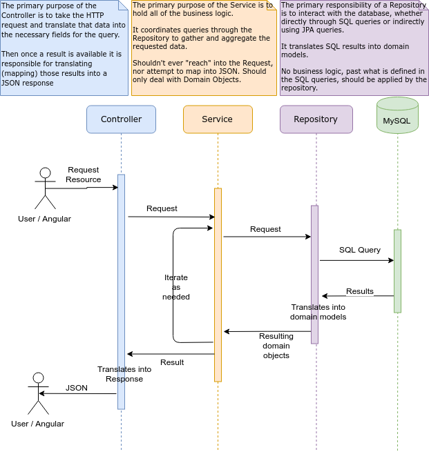

# Architecture

- [Architecture](#architecture)
  * [Project Structure](#project-structure)
  * [Separation of Concerns](#separation-of-concerns)
  * [Spring Initializr](#spring-initializr)

## Project Structure

```
shmoozed/
+--- src/main/java/com/shmoozed/
|   +--- controller/   (1)
|   +--- model/        (2)
|   +--- remote/       (3)
|   +--- repository/   (4)
|   +--- service/      (5)
|
+--- src/main/resources/
|   +--- application.properties   (6)
|
+--- src/test/java/com/shmoozed   (7)
|
+--- pom.xml      (8)
+--- Dockerfile   (9)
```

1. **`controller`**: The Endpoint declarations. Classes in this directory generally are annotated with `@RestController` and `@RequestMapping(path = "/X/Y/Z")`. Then also declare `@GetMapping`, `@PostMapping`, etc.
2. **`model`**: POJOs for the various objects stored in the database as well as returned from the API.
3. **`remote`**: Special classes which interact with remote services (such as Walmart, Target, Amazon, etc.). Classes in this directory generally are annoted with `@Component` and are `@Autowired` into other `Service` classes for use.
4. **`repository`**: JPA ([Java Persistence API](https://en.wikipedia.org/wiki/Java_Persistence_API)) Interfaces to interact with the MySQL Database. Interfaces in this directory generally extend `org.springframework.data.repository.CrudRepositoryorg.springframework.data.repository.CrudRepository`. Though not annotated, Spring provides implemtation beans which are `@Autowired` into `Service` classes for use. 
5. **`service`**: Business Logic classes. Classes in this directory are generally annotated with `@Service`. They may `@Autowire` in other `Service` or `Repository` classes to fulfill their necessary logic. Are usually `@Autowire` into `Controller` classes.
6. **`application.properties`**: Application configuration is contained in this file. Configurations for logging level, credentials, application port, etc. are defined here. Custom configurations can be created here and injected into classes with `@Value("${some.custom-configuration}")`. A testing-specific version is at `src/test/resources/` which is applied while running `@SpringBootTest` tests.
7. **Tests**: Unit / Component Tests.
8. **`pom.xml`**: The "blueprint" for the Shmoozed service. Manages Dependencies, Versions, and the Build.
9. **`Dockerfile`**: The definition for the Docker image for the Shmoozed backend api.

## Separation of Concerns

A rigid structure is implemented by the backend to ensure separation of concerns at each point in the request
process. The following diagram illustrates the process of a request for data coming from a user/client. By following
these standards it helps to avoid "spaghetti code".



## Spring Initializr

The back-end app was originally generated using [Spring Initializr](https://start.spring.io/)
