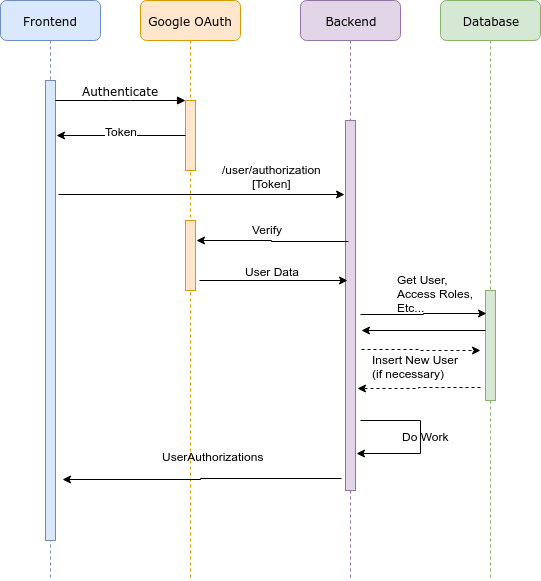

# Authentication

## Google Authentication

We are using Google Authentication as our primary authentication source. Specifically this project
uses the OAuth2 protocol.

* https://developers.google.com/identity/protocols/OAuth2 

## Sequence



## Contract

After authenticating through Google, the frontend will call the backend on the `/user/authorization` endpoint. The frontend will pass the 
token which was generated by Google. 

The backend with verify that token. It will then select the user information from the database. If a user doesn't yet exist, a new user 
will be automatically created.

The backend will respond with a `UserAuthorizations` object:

```json
{
  "token":"ya29.QQIBibTwvKkT_mXZo6sQa36VHfyuBe",
  "roles":["BUYER", "SELLER", "ADMIN", ...]
}

```

The backend will create the above `token` which is returned to the frontend. This token should be included by the frontend in all subsequent 
calls to the backend when requesting resources.

The `roles` will contain an arbitrary set of strings indicating what roles the authenticated user has permissions to perform. These roles
may be used to, for example, activate/deactivate certain features in the UI. These roles will be informational for the frontend. Access to
certain API resources may be retricted (such as retreiving the list of Users) so the roles a user has will be enforced by the API.

### Initial Token Implementation & Future Direction (JWT Tokens)

Initially, the backend will simply use the token provided by Google and associate it with a user id. This association will be made based
on the user's email address provided by Google. For the initial implementation, a lookup on the token to Google will take place on each 
API request.

If there is a large performance hit because of those remote calls, the backend will store an association between token and user id in the
database for faster retrieval. Using this strategy allows the easiest path forward.

Future work will be done to implement better, more robust, token support. Likely that support would be through the use of 
[JWT Tokens](https://jwt.io/). Because the backend will already be providing a token that the client should pass along with all API requests,
changing to a JWT Token should be transparent to the frontend and only require changes to the backend code.

## Response Codes

* `401` = Invalid / expired / bad / missing token
* `403` = Insufficient permissions to acess the requested resource
