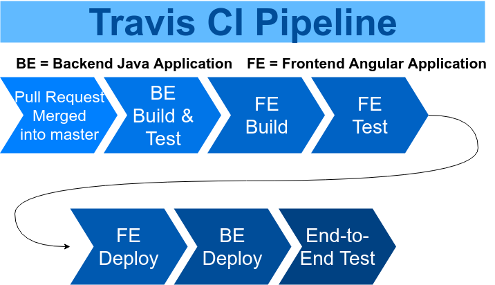

# Continuous Integration / Continuous Delivery

## Travis CI Pipeline

## Technologies Considered

| Technology | Link | Free? | Self-hosted / Cloud | Notes |
|------------|-------------------------------------|-------------------------------------------------------------------------|---------------------|-----------------------------------------------------------------------------------------------------------|
| Jenkins | https://jenkins.io/ | Yes | Self-hosted | Market leader for open-source CI/CD. |
| Travis CI | https://travis-ci.com/ | GitHub Student Pack (Free $69/month) OR First 100 builds normal account | Cloud |  |
| Codeship | https://codeship.com/ | Yes, 100 builds/month | Cloud |  |
| TeamCity | https://www.jetbrains.com/teamcity/ | Yes | Self-hosted | Same company who make IntelliJ, Docker image available |
| Bamboo | https://www.atlassian.com/software/bamboo/pricing | $10 | Self-hosted | Same company who make JIRA |
| Circle CI | https://circleci.com/ | Yes, 1 "container" 1000 build minutes/month | Cloud |  |
| GitLab | https://docs.gitlab.com/ee/ci/ | Yes(ish) | Cloud | Alternative to GitHub for Git repo hosting. Has built in CI/CD tools. Some of which are free, others not. |
| Atomist | https://atomist.com/pricing.html | No (possibly send email for free license?) | Cloud | Cloud-native, very new project. Seems like steep learning curve. |

Based on our research, we have decided to use *Travis CI* for Shmoozed CI/CD needs.

## Travis CI Information

The `.travis.yml` defines the steps for the build and deploy. 

We are in an unusual setup because of the way our repo is organized. Traditionally you would have your Backend and Frontend applications in 
different repositories so Travis CI expects that out of the box. Since we have a single repository with nested projects in subfolders, there 
are some hoops we are going to have to jump through in order for it to work for us. 

1. Travis has certain virtual machines it uses to run the builds, etc. based of the `language` choice. While looking at these the machine for node application had everything needed for the frontend but did _not_ have everything needed for the backend. However, the `Java` language VM _did_ come with NVM, Node, and NPM installed already. So that is the base language chosen for our environment.
2. Because of the above, the main parts of the file will focus on deploying the Backend.
3. The build and deploy of the Frontend will be done via the `script:` section of the build file.
4. The Backend will utilize the `deploy:` section of the build file.

## Frontend CI/CD Strategy

1. npm install
2. ng build
3. ng test
4. Deploy files (SCP/FTP) from dist directory to server

## Backend CI/CD Strategy

1. Test (Unit & Component Tests)
2. Build & Package 
   * `mvn clean install`
2. Deploy JAR
3. Validate API (Integration Tests)
4. Launch UI Fullstack Tests (Acceptance Tests)

### Backend Travis / Elastic Beanstalk Deploy Setup

Instructions for setting up the Backend deploy via Elastic Beanstalk directly can be found at https://docs.travis-ci.com/user/deployment/elasticbeanstalk/

Note that credentials for deploying must be encrypted via the `travis-cli` tool. That involves installing Ruby and a Gem they created for it. Ick...
Thanksfully, a docker image was created by a group and available to use without needing to install Ruby, the gem, etc. It is available at 
https://hub.docker.com/r/skandyla/travis-cli/ Follow the instructions on the docker image to run commands against the `travis-cli`.

I chose to use the `travis setup elasticbeanstalk` option in the Travis instructions instead of setting it all up by hand. This made it go alot smoother.

### Frontend Travis Deploy Setup

Travis runs in a "headless" environment. As such, certain considerations need to be made when configuring the Travis CI pipeline for the Frontend.
* https://karma-runner.github.io/3.0/plus/travis.html
* https://docs.travis-ci.com/user/gui-and-headless-browsers/
* https://medium.com/@swanandkeskar/angular-5-travis-ci-continuous-integration-deployment-fe9090f460c5

### Travis CLI

Some useful links related to the Travis CLI:
* https://github.com/travis-ci/travis.rb#command-line-client
* https://hub.docker.com/r/skandyla/travis-cli/

